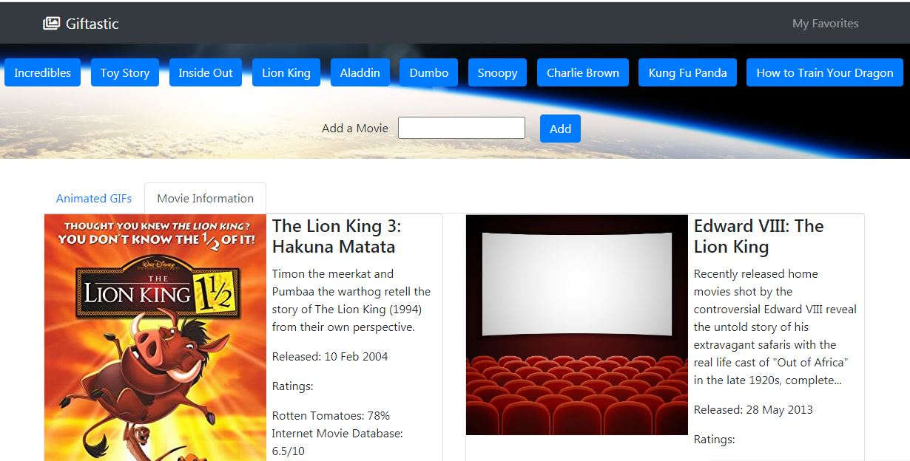

# Giftastic

## Overview 

* Initializing an array of strings, each one related to a movie's topic
* Using the initial topics, each one is a button in the app
* When the user clicks on a button, the page displays 10 GIFs in the first tab, and 10 movies in the second tab, non-animated gif images from the GIPHY API and place them on the page.
* If user clicks again over the same button it will add more 10 GIFs and movies
* When the user clicks one of the still GIPHY images, the gif is animated. If the user clicks the gif again the gif is stopped.
* Under every gif, display its rating
* User can add more buttons after writing any other topic
* There is a favorite section where the GIF or movie is added when the user clicks the heart button so it can be reviewed to know the user selection

  
  

## Technologies used to develop the app
- HTML5
- CSS3
- Bootstrap
- Javascript
- JQuery
- AJAX

## App Link
https://jfsilvah.github.io/Giftastic/index.html

## Author
ISC Francisco Silva
